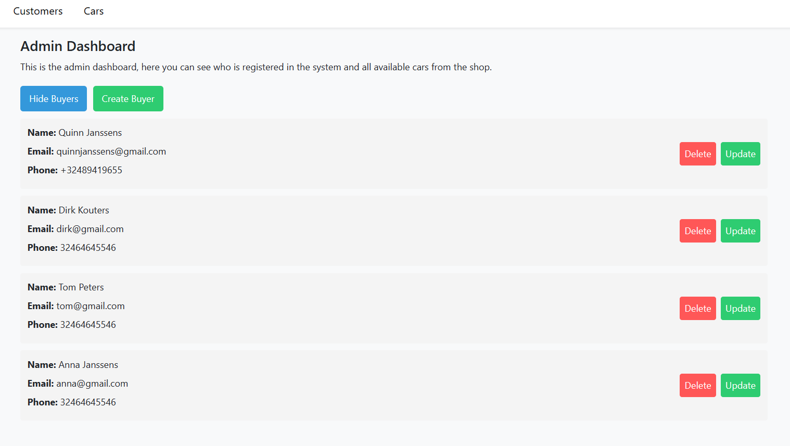
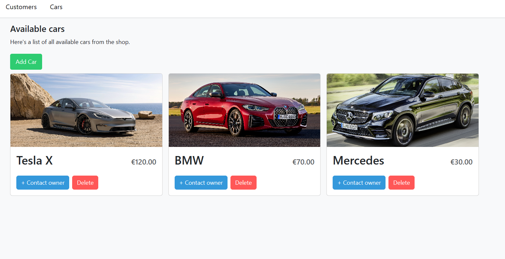

# Getting started

=================

# What is this project?

This project is meant for carshop owner(s). It's the admin page for the owner(s).
This project gives more clarity about the amount of buyers there are, along with their personal information. As well as all the available cars in the shop.
The admin can add, delete or update buyers and cars on any given moment, to be able to manage the shop in the best way possible.

Here are 2 images to visualize the idea more:

# Why is this project useful?

The concept of the project is simple. This can be extended to any idea in the same branch.
This project can be used as a great backbone when contributers would like to work out their own idea.

# How to build something similar?

- Setup CI pipeline in frontend.
- Setup CI pipeline in backend.
- Setup Docker container.
- Create models for database (Prisma).
- (SQLite allows me to quickly add data to smaller scale projects like this one).
- Add routers and services in backend (In this project for buyers and cars).
- Add frontend logic (React + Typescript + Vite).
- Write tests for endpoints and local functions.
- Deployment (Google Firebase).

When using Git, please update the main branch with pull requests only (to prevent sloppy work).
All branches need to be merged into the main branch.

When errors occured, looking up the error and reading documentation is recommended.
When tests are written succesfully, errors are clear when they occur.

# Status of the current project

CI/CD pipeline implemented.
Hosted using docker container.
Basic CRUD operations are functional.
Testing is implemented and works.

The project has some features but to make the application more useful, some ideas could be implemented:

- A record of all the previous sales made, where a buyer is linked to the bought car.
- A delete system that could automatically delete inactive buyers who are in the system.
- If project takes on larger scale, finding new database instead of SQLite.
